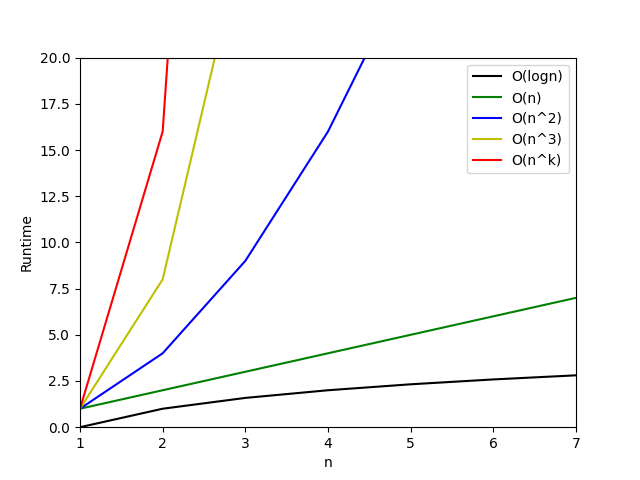

# Assignment 1
* Started by importing matplotlib, numpy, math.
* Then I created an array "np.linspace".
* After that using different array operations, created required arrays that I used next to plot which emulate the Big O notations.

### By looking at the graph, it is visible that O(logn) is the best.

(Please excuse my Markdown skills. I'm new in GitHub)
